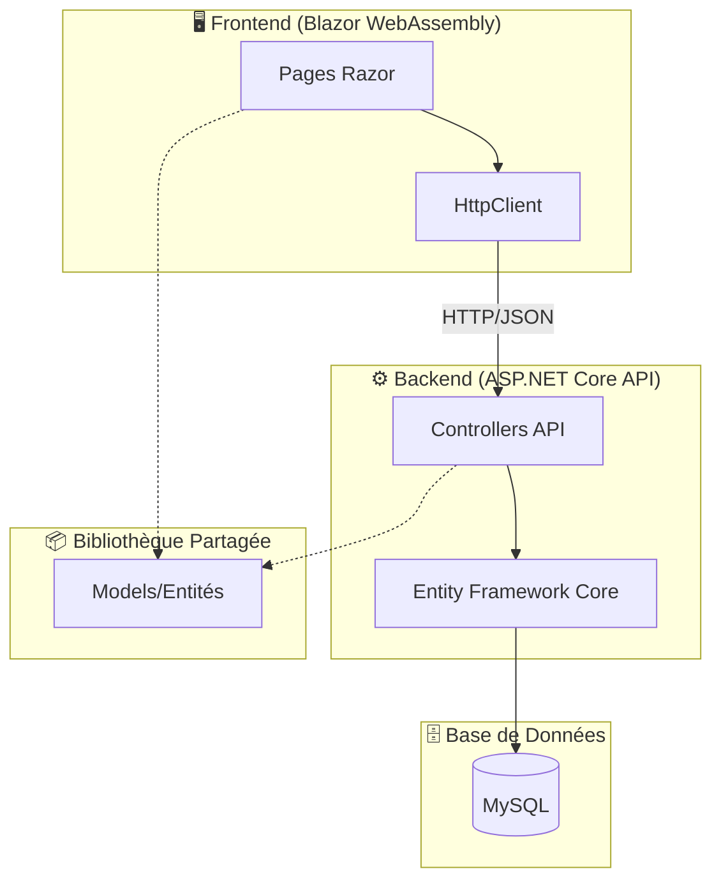
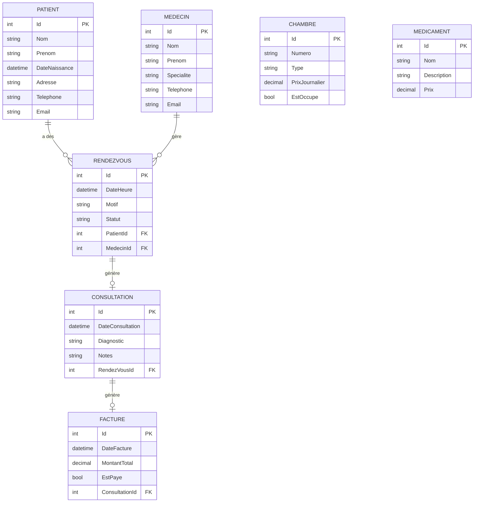
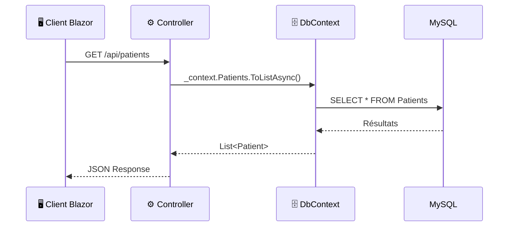
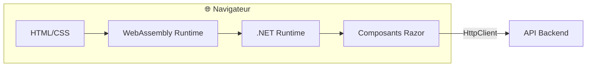
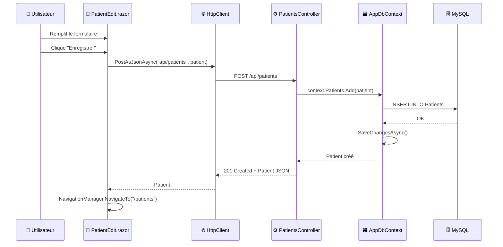

# 📋 GestionClinique - Documentation du Projet

Documentation complète du projet de gestion de clinique médicale développé avec **.NET 8** et **Blazor WebAssembly**.

---

## 🏗️ Architecture Générale du Projet

Le projet suit une architecture **3-tiers** classique avec une séparation claire des responsabilités :



---

## 📁 Structure des Projets

Le projet est organisé en **3 sous-projets** dans une solution .NET :

| Projet | Rôle | Technologies |
|--------|------|--------------|
| **GestionClinique.Server** | Backend API REST | ASP.NET Core, Entity Framework Core |
| **GestionClinique.Client** | Frontend SPA | Blazor WebAssembly |
| **GestionClinique.Shared** | Modèles partagés | Classes C# (entités) |

```
GestionClinique/
├── GestionClinique.sln              # Solution Visual Studio
├── GestionClinique.Server/          # 🔵 Backend API
│   ├── Controllers/                 # Contrôleurs REST
│   ├── Data/                        # DbContext
│   ├── Migrations/                  # Migrations EF Core
│   └── Program.cs                   # Point d'entrée serveur
├── GestionClinique.Client/          # 🟢 Frontend Blazor
│   ├── Pages/                       # Composants Razor
│   ├── Layout/                      # Layout principal
│   └── wwwroot/                     # Assets statiques
└── GestionClinique.Shared/          # 🟡 Modèles partagés
    └── Models/                      # Entités du domaine
```

---

## 🗄️ Base de Données (MySQL)

### Configuration de Connexion

La chaîne de connexion se trouve dans `appsettings.json` :

```json
{
  "ConnectionStrings": {
    "DefaultConnection": "server=127.0.0.1;port=8889;database=clinique_db;user=root;password=root"
  }
}
```

### Modèle de Données (7 Entités)



### Description des Entités

| Entité | Fichier | Description |
|--------|---------|-------------|
| **Patient** | `GestionClinique.Shared/Models/Patient.cs` | Informations du patient (nom, prénom, contact, adresse) |
| **Medecin** | `GestionClinique.Shared/Models/Medecin.cs` | Praticien médical avec spécialité |
| **RendezVous** | `GestionClinique.Shared/Models/RendezVous.cs` | Planification patient/médecin |
| **Consultation** | `GestionClinique.Shared/Models/Consultation.cs` | Acte médical avec diagnostic |
| **Facture** | `GestionClinique.Shared/Models/Facture.cs` | Facturation des consultations |
| **Chambre** | `GestionClinique.Shared/Models/Chambre.cs` | Gestion des chambres (Simple/Double/VIP) |
| **Medicament** | `GestionClinique.Shared/Models/Medicament.cs` | Inventaire des médicaments |

---

## ⚙️ Backend - API REST (GestionClinique.Server)

### Comment ça marche ?

Le backend est une **API REST** construite avec ASP.NET Core. Voici le flux :



### Point d'entrée : Program.cs

Le fichier `GestionClinique.Server/Program.cs` configure :

1. **Entity Framework Core** avec MySQL
2. **CORS** pour permettre les requêtes cross-origin
3. **Swagger** pour la documentation API

```csharp
// Configuration de la base de données
builder.Services.AddDbContext<AppDbContext>(options =>
    options.UseMySql(connectionString, ServerVersion.AutoDetect(connectionString)));

// Configuration CORS (permet au frontend d'appeler l'API)
builder.Services.AddCors(options => {
    options.AddPolicy("AllowAll", builder => {
        builder.AllowAnyOrigin().AllowAnyMethod().AllowAnyHeader();
    });
});
```

### Controllers (7 API Endpoints)

Chaque entité a son contrôleur avec les opérations **CRUD** :

| Controller | Route | Opérations |
|------------|-------|------------|
| `PatientsController.cs` | `/api/patients` | GET, POST, PUT, DELETE |
| `MedecinsController.cs` | `/api/medecins` | GET, POST, PUT, DELETE |
| `RendezVousController.cs` | `/api/rendezvous` | GET, POST, PUT, DELETE |
| `ConsultationsController.cs` | `/api/consultations` | GET, POST, PUT, DELETE |
| `FacturesController.cs` | `/api/factures` | GET, POST, PUT, DELETE |
| `ChambresController.cs` | `/api/chambres` | GET, POST, PUT, DELETE |
| `MedicamentsController.cs` | `/api/medicaments` | GET, POST, PUT, DELETE |

#### Exemple : PatientsController

```csharp
[Route("api/[controller]")]
[ApiController]
public class PatientsController : ControllerBase
{
    private readonly AppDbContext _context;

    // GET: api/Patients - Liste tous les patients
    [HttpGet]
    public async Task<ActionResult<IEnumerable<Patient>>> GetPatients()
    {
        return await _context.Patients.ToListAsync();
    }

    // POST: api/Patients - Crée un nouveau patient
    [HttpPost]
    public async Task<ActionResult<Patient>> PostPatient(Patient patient)
    {
        _context.Patients.Add(patient);
        await _context.SaveChangesAsync();
        return CreatedAtAction("GetPatient", new { id = patient.Id }, patient);
    }
}
```

### AppDbContext

Le fichier `GestionClinique.Server/Data/AppDbContext.cs` définit les **DbSet** pour chaque entité :

```csharp
public class AppDbContext : DbContext
{
    public DbSet<Patient> Patients { get; set; }
    public DbSet<Medecin> Medecins { get; set; }
    public DbSet<RendezVous> RendezVous { get; set; }
    public DbSet<Consultation> Consultations { get; set; }
    public DbSet<Medicament> Medicaments { get; set; }
    public DbSet<Chambre> Chambres { get; set; }
    public DbSet<Facture> Factures { get; set; }
}
```

---

## 🖥️ Frontend - Blazor WebAssembly (GestionClinique.Client)

### Comment ça marche ?

Blazor WebAssembly est un framework **SPA** (Single Page Application) qui s'exécute dans le navigateur via WebAssembly.



### Configuration Client

Le fichier `GestionClinique.Client/Program.cs` configure le HttpClient :

```csharp
var builder = WebAssemblyHostBuilder.CreateDefault(args);
builder.RootComponents.Add<App>("#app");

// Configuration de l'API URL
builder.Services.AddScoped(sp => 
    new HttpClient { BaseAddress = new Uri("http://localhost:5280/") });
```

### Pages Blazor (15 composants)

Les pages utilisent la syntaxe **Razor** (HTML + C#) :

| Page | Route | Description |
|------|-------|-------------|
| `Home.razor` | `/` | Tableau de bord |
| `Patients.razor` | `/patients` | Liste des patients |
| `PatientEdit.razor` | `/patients/edit/{id}` | Édition patient |
| `MedecinsList.razor` | `/medecins` | Liste des médecins |
| `RendezVousList.razor` | `/rendezvous` | Liste des rendez-vous |
| `ConsultationsList.razor` | `/consultations` | Liste des consultations |
| `FacturesList.razor` | `/factures` | Liste des factures |
| `ChambresList.razor` | `/chambres` | Liste des chambres |
| `MedicamentsList.razor` | `/medicaments` | Liste des médicaments |

#### Exemple : Page Patients

```razor
@page "/patients"
@using GestionClinique.Shared.Models
@inject HttpClient Http

<h1>Liste des Patients</h1>

<a href="patients/create" class="btn btn-primary">Nouveau Patient</a>

@if (patients == null)
{
    <p><em>Chargement...</em></p>
}
else
{
    <table class="table">
        @foreach (var patient in patients)
        {
            <tr>
                <td>@patient.Nom</td>
                <td>@patient.Prenom</td>
                <td>
                    <a href="patients/edit/@patient.Id">Editer</a>
                    <button @onclick="() => DeletePatient(patient.Id)">Supprimer</button>
                </td>
            </tr>
        }
    </table>
}

@code {
    private List<Patient>? patients;

    protected override async Task OnInitializedAsync()
    {
        patients = await Http.GetFromJsonAsync<List<Patient>>("api/patients");
    }

    private async Task DeletePatient(int id)
    {
        await Http.DeleteAsync($"api/patients/{id}");
        await LoadPatients();
    }
}
```

### Layout Principal

Le fichier `GestionClinique.Client/Layout/MainLayout.razor` définit la structure avec :

- **Sidebar** avec navigation
- **Zone principale** pour le contenu

---

## 🔄 Flux de Données Complet

Voici comment fonctionne une opération complète (ex: Ajouter un patient) :



---

## 🚀 Comment Lancer le Projet

### Prérequis

- **.NET 8 SDK**
- **MySQL** (local ou MAMP sur port 8889)
- Base de données: `clinique_db`

### Commandes

```bash
# 1. Démarrer le serveur API (port 5280)
cd GestionClinique/GestionClinique.Server
dotnet run

# 2. Dans un autre terminal, démarrer le client Blazor
cd GestionClinique/GestionClinique.Client
dotnet run
```

### URLs

| Service | URL |
|---------|-----|
| Frontend Blazor | http://localhost:5081 |
| API Backend | http://localhost:5280 |
| Swagger UI | http://localhost:5280/swagger |

---

## 📚 Technologies Utilisées

| Technologie | Version | Usage |
|-------------|---------|-------|
| .NET | 8.0 | Framework principal |
| Blazor WebAssembly | 8.0 | Frontend SPA |
| ASP.NET Core | 8.0 | Backend API |
| Entity Framework Core | 8.0 | ORM (accès BDD) |
| MySQL | 8.x | Base de données |
| Pomelo.EntityFrameworkCore.MySql | 8.0 | Provider MySQL pour EF |

---

## 🎓 Concepts Clés à Comprendre

### 1. Pattern Repository avec EF Core
Le `DbContext` agit comme un repository, gérant les connexions et les requêtes vers MySQL.

### 2. Injection de Dépendances
Les services (DbContext, HttpClient) sont injectés automatiquement via `@inject`.

### 3. API REST
Communication standardisée avec les verbes HTTP :
- `GET` = Lire
- `POST` = Créer
- `PUT` = Modifier
- `DELETE` = Supprimer

### 4. Blazor Component Lifecycle
- `OnInitializedAsync()` = Appelé au chargement du composant
- `StateHasChanged()` = Force le re-rendu de l'UI

---

> **💡 TIP:** Pour tester l'API sans le frontend, ouvrez **Swagger UI** à l'adresse http://localhost:5280/swagger
